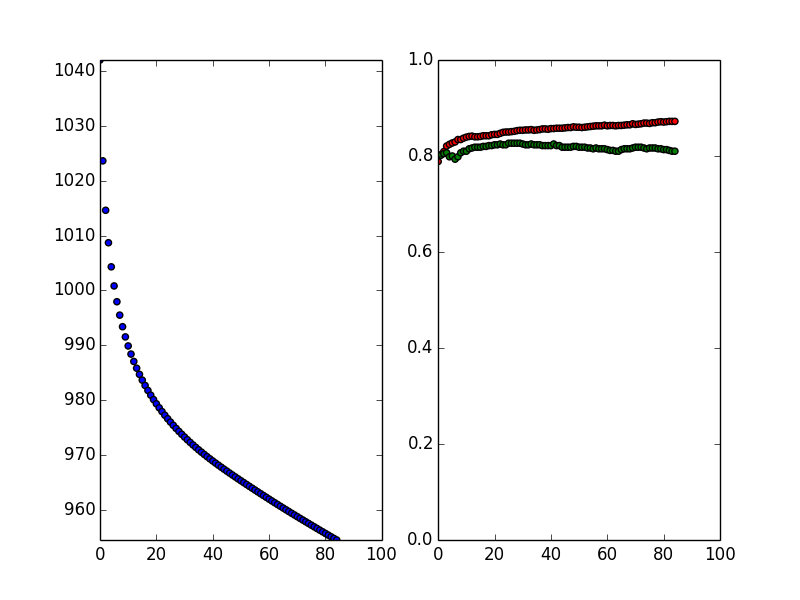

# Framework for Big Machine Learning
- Reference paper: https://www.aaai.org/Papers/AAAI/1992/AAAI92-019.pdf

The framework is designed as follows:
1. read data and vectorize it as dict (mainly for discreted data)
2. use chimerge to get the intervals for discretization
3. use intervals to discret the continuous data (do hash)
4. do combination for features (do hash)
5. fm training

## Experiments and Evaluation
### SK models (30,000+ sampels)
```
LR-l1
    alpha: 0.5 Average accuracy, train:  0.853106476533 test:  0.851816562766
    alpha: 1 Average accuracy, train:  0.853029655357 test:  0.852737797205
    alpha: 5 Average accuracy, train:  0.85352110843 test:  0.851570976651
    alpha: 10 Average accuracy, train:  0.853597859575 test:  0.851939450619
    alpha: 100 Average accuracy, train:  0.854043173821 test:  0.851263703256

LR-l2:
    alpha: 0.5 Average accuracy, train:  0.797579947325 test:  0.797426449705
    alpha: 1 Average accuracy, train:  0.797242096283 test:  0.797149909592
    alpha: 5 Average accuracy, train:  0.797948462324 test:  0.797856308175
    alpha: 10 Average accuracy, train:  0.797395653749 test:  0.796996427112
    alpha: 100 Average accuracy, train:  0.797779581368 test:  0.797272882335

RF: (max_depth)
    alpha: 2 Average accuracy, train:  0.789150063949 test:  0.78769943581
    alpha: 5 Average accuracy, train:  0.840999924201 test:  0.836300546671
    alpha: 8 Average accuracy, train:  0.858699856786 test:  0.846799826953
    alpha: 20 Average accuracy, train:  0.938849869688 test:  0.844800076888
    alpha: 50 Average accuracy, train:  0.988749999944 test:  0.835400006707
```
LR with l1 regularization term achieves about 85% accuracy, while others perform not very well. The following outputs show the accuracy of using LR with feature selection(RandomForest). It is interesting to find that the accuracy is from 84% to about 85%. In other words, the feature selection does not impact the accuracy that much. However, this method, which use random forest to select features, can be used to do reduction.

```
RF for feature selection:
    Features numbers:  108 Now:  10
    cut_ratio: 0.1 alpha: 0.5 Average accuracy, train:  0.845290362896 test:  0.844906435762
    cut_ratio: 0.1 alpha: 1 Average accuracy, train:  0.844921872656 test:  0.844353746033
    cut_ratio: 0.1 alpha: 5 Average accuracy, train:  0.844937220904 test:  0.844753015536
    cut_ratio: 0.1 alpha: 10 Average accuracy, train:  0.844860405387 test:  0.845274971983
    cut_ratio: 0.1 alpha: 100 Average accuracy, train:  0.845121462133 test:  0.844660801542
    Features numbers:  108 Now:  21
    cut_ratio: 0.2 alpha: 0.5 Average accuracy, train:  0.848330802984 test:  0.847516962205
    cut_ratio: 0.2 alpha: 1 Average accuracy, train:  0.848422958261 test:  0.848100464447
    cut_ratio: 0.2 alpha: 5 Average accuracy, train:  0.848361560316 test:  0.848407698226
    cut_ratio: 0.2 alpha: 10 Average accuracy, train:  0.848054432651 test:  0.847639869865
    cut_ratio: 0.2 alpha: 100 Average accuracy, train:  0.848238646292 test:  0.848223151391
    Features numbers:  108 Now:  43
    cut_ratio: 0.4 alpha: 0.5 Average accuracy, train:  0.851616962889 test:  0.85104877968
    cut_ratio: 0.4 alpha: 1 Average accuracy, train:  0.851862655825 test:  0.850987366881
    cut_ratio: 0.4 alpha: 5 Average accuracy, train:  0.851893347369 test:  0.850557361267
    cut_ratio: 0.4 alpha: 10 Average accuracy, train:  0.85170910614 test:  0.851417403622
    cut_ratio: 0.4 alpha: 100 Average accuracy, train:  0.852615089954 test:  0.850127454692
    Features numbers:  108 Now:  64
    cut_ratio: 0.6 alpha: 0.5 Average accuracy, train:  0.852507575818 test:  0.851048677812
    cut_ratio: 0.6 alpha: 1 Average accuracy, train:  0.852261865198 test:  0.85203140994
    cut_ratio: 0.6 alpha: 5 Average accuracy, train:  0.853029692848 test:  0.851816551448
    cut_ratio: 0.6 alpha: 10 Average accuracy, train:  0.852922221156 test:  0.851970209368
    cut_ratio: 0.6 alpha: 100 Average accuracy, train:  0.852891494949 test:  0.851110167013
    Features numbers:  108 Now:  86
    cut_ratio: 0.8 alpha: 0.5 Average accuracy, train:  0.853121845296 test:  0.852246582529
    cut_ratio: 0.8 alpha: 1 Average accuracy, train:  0.85327538154 test:  0.852031534447
    cut_ratio: 0.8 alpha: 5 Average accuracy, train:  0.853382856062 test:  0.852246443874
    cut_ratio: 0.8 alpha: 10 Average accuracy, train:  0.853459658139 test:  0.851540178286
    cut_ratio: 0.8 alpha: 100 Average accuracy, train:  0.853521082964 test:  0.851878012352
    Features numbers:  108 Now:  108
    cut_ratio: 1 alpha: 0.5 Average accuracy, train:  0.852691877176 test:  0.852062279047
    cut_ratio: 1 alpha: 1 Average accuracy, train:  0.853260068661 test:  0.851847434703
    cut_ratio: 1 alpha: 5 Average accuracy, train:  0.853521094282 test:  0.851202395155
    cut_ratio: 1 alpha: 10 Average accuracy, train:  0.854012476617 test:  0.85190877959
    cut_ratio: 1 alpha: 100 Average accuracy, train:  0.854135350319 test:  0.850465387797
```

The following outputs is obtained by feature discretization and combination. It is easily to know that all of the models are overfitting, expect SVM with RBF kernel. Within LR model, even using l2 regularization term can not solve overfitting.

### BML (discretization, combination of features)
```
FM: cost:  941.893938389 accuracy_train:  0.845714285714 accuracy_test: 0.816666666667
SVM-RBF: Average accuracy, train:  0.745498872186 test:  0.738515461569
SVM-LINEAR: (C has been grid searched)
    alpha: 0.5 Average accuracy, train:  0.821492031762 test:  0.769491047934
    alpha: 1 Average accuracy, train:  0.835750293022 test:  0.778002553452
    alpha: 5 Average accuracy, train:  0.849253676465 test:  0.768514023005
    alpha: 10 Average accuracy, train:  0.849003051027 test:  0.779505553458
    alpha: 100 Average accuracy, train:  0.854747926337 test:  0.771001540463

10,000 samples
LR-l1
    alpha: 0.5 Average accuracy, train:  0.856449706768 test:  0.837599206831
    alpha: 1 Average accuracy, train:  0.864600056826 test:  0.836400106717
    alpha: 5 Average accuracy, train:  0.881649946906 test:  0.822700356418
    alpha: 10 Average accuracy, train:  0.88469992942 test:  0.819100086373
    alpha: 100 Average accuracy, train:  0.885550134434 test:  0.814500436246
    alpha: 1000 Average accuracy, train:  0.88580002443 test:  0.811100276194

LR-l2
    alpha: 0.5 Average accuracy, train:  0.855900041782 test:  0.839100046777
    alpha: 1 Average accuracy, train:  0.86305008932 test:  0.836500236706
    alpha: 5 Average accuracy, train:  0.883200131923 test:  0.822800186437
    alpha: 10 Average accuracy, train:  0.883999919416 test:  0.82389987649
    alpha: 100 Average accuracy, train:  0.886949891929 test:  0.811499806249
    alpha: 1000 Average accuracy, train:  0.886700114439 test:  0.806800146121
```

This figure illustrates the training process of FM model. From which we can obtain that the training accuracy becomes better while the test accuracy decreases. In this case, early stopping criteria can not be used since the loss is very high when train accuracy balance the test accuracy.


However, the stopping criteria may not solve the overfitting problem since the splines converge to totally different directions. The thing is the binning operation will always lose informance. However this method could handle large amount of data, and speed up the training progress. For example, in logistic regression, gradient of `W`, `dW=X*(dL/dY)`, since `X` has been simplified to 0 or 1, the multiplication operations have been reomved, which could save much time of training.

SO, I guess splines methods are always to be prefered from a predictive standpoint.
